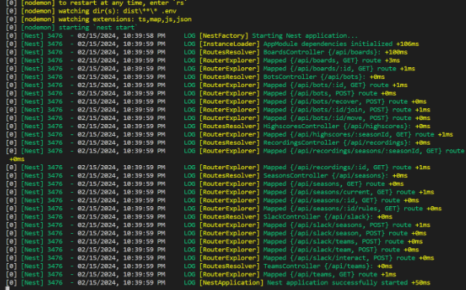

<h1 align="center"> Tugas Besar 1 IF2211 Strategi Algoritma </h1>
<h1 align="center">  Pemanfaatan Algoritma <em> Greedy </em> dalam Pembuatan Bot Permainan <em> Diamonds </em> </h1>


## Contributors
### **Kelompok 8 "Omega"**
|   NIM    |                  Nama                  |
| :------: | :------------------------------------: |
| 13522053 |       Erdianti Wiga Putri Andini       |
| 13522085 |          Zahira Dina Amalia            |
| 13522101 |           Abdullah Mubarak             |

## Deskripsi Program
Diamonds adalah sebuah tantangan pemrograman di mana bot yang dibuat akan bersaing dengan bot dari pemain lain untuk mengumpulkan sebanyak mungkin berlian. Setiap bot dimiliki oleh satu pemain dan tujuannya adalah mengumpulkan sebanyak mungkin berlian. Namun, permainannya tidaklah mudah karena ada berbagai rintangan yang membuat permainan menjadi menarik dan rumit. Untuk menang, setiap pemain harus mengembangkan strategi khusus untuk bot mereka masing-masing.

Pada program kami, kami menggabungkan dua algoritma *greedy* yaitu *Greedy by Distance and Diamond Type* sebagai strategi bot kami. Algoritma ini mengutamakan jarak terdekat yang harus ditempuh untuk mencapai diamond dan mengutamakan diamond merah dibandingkan biru.

## Project Structure

## Requirements Program
1. **Game Engine**
    Requirement yang harus di-install: 
    - Node.js (https://nodejs.org/en) 
    - Docker desktop (https://www.docker.com/products/docker-desktop/) 
    - Yarn
        ```bash
        npm install --global yarn
        ```
2. **Bot Starter Pack**
    Requirement yang harus di-install
    - Python (https://www.python.org/downloads/) 


## Instalasi Awal dan Setup
1. Men-*download* starter pack file .zip game engine yang terdapat pada tautan https://github.com/haziqam/tubes1-IF2211-game-engine/releases/tag/v1.1.0

    a. Setelah melakukan instalasi, *extract* file .zip tersebut.
    
    b. Masuk ke root directory dari program dengan menjalankan perintah berikut pada terminal untuk masuk ke root directory dari game engine.
    ```bash
    cd tubes1-IF2110-game-engine-1.1.0
    ```
    c. Menginstall dependencies dengan menggunakan yarn. 
    ``` bash
    yarn
    ```
    d. Melakukan setup environment variable dengan menjalankan script berikut
    Untuk Windows
    ```bash
    ./scripts/copy-env.bat
    ```
	Untuk Linux / (possibly) macOS
    ```bash
    chmod +x ./scripts/copy-env.sh
    ./scripts/copy-env.sh
    ```    
    e. Melakukan setup local database dengan membuka aplikasi docker desktop terlebih dahulu kemudian menjalankan *command* berikut di terminal
    ```bash
    docker compose up -d database
    ```
    f. Kemudian menjalankan script berikut. 
    Untuk Windows
    ```bash
    ./scripts/setup-db-prisma.bat
    ```
    Untuk Linux / (possibly) macOS
    ```bash
    chmod +x ./scripts/setup-db-prisma.sh
    ./scripts/setup-db-prisma.sh
    ```
    g. Menjalankan perintah berikut untuk melakukan build frontend dari game-engine.
    ```bash
    npm run build
    ```
    h. Menjalankan perintah berikut untuk memulai game-engine.
    ```bash
    npm run start
    ```
    i. Jika berhasil, tampilan terminal akan terlihat seperti gambar di bawah ini.
    


2. Men-*download* bot starter pack dengan ekstensi .zip yang terdapat pada tautan https://github.com/haziqam/tubes1-IF2211-bot-starter-pack/releases/tag/v1.0.1 
    
    a. Melakukan *extract* file zip tersebut, kemudian masuk ke folder hasil *extract*.

    b. Membuka terminal dan menjalankan perintah berikut untuk masuk ke root directory dari project.
    ```bash
    cd tubes1-IF2110-bot-starter-pack-1.0.1
    ```
    c. Menginstall dependencies dengan menggunakan pip.
    ```bash
    pip install -r requirements.txt
    ```
    d. Menjalankan program dengan cara menjalankan perintah berikut. 
    ``` bash
    python main.py --logic omegaBot --email=your_email@example.com --name=your_name --password=your_password --team etimo
    ```
    e. Untuk menjalankan satu beberapa bot, dapat menggunakan perintah berikut.
    Untuk windows
    ```
    ./run-bots.bat
    ```
    Untuk Linux / (possibly) macOS
    ```
    ./run-bots.sh
    ```

## Hasil Uji Coba Program